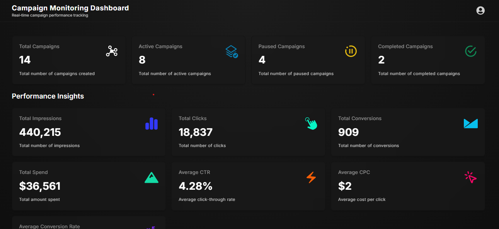

# Campaign Dashboard

## Overview

A modern, responsive campaign management dashboard built with Next.js and React. This application provides a comprehensive platform for managing marketing campaigns, tracking insights, and visualizing campaign performance metrics.

## Dashboard Preview



## Features

- **Campaign Management**: Create, view, and manage marketing campaigns
- **Real-time Insights**: Track campaign metrics and performance data
- **Responsive Design**: Fully responsive UI that works seamlessly on all devices
- **Interactive Charts & Cards**: Visual representation of campaign data
- **Pagination**: Easy navigation through large datasets
- **Modern UI Components**: Custom-built components with smooth animations

## Tech Stack

### Frontend Framework
- **Next.js 16.1.1** - React framework for production
- **React 19.2.3** - JavaScript library for building user interfaces
- **TypeScript** - Type-safe JavaScript

### Styling & UI
- **Tailwind CSS 4** - Utility-first CSS framework
- **Radix UI** - Unstyled, accessible UI components
- **CVA** (Class Variance Authority) - Type-safe CSS-in-TS
- **Lucide React** - Beautiful, consistent icon library
- **React Icons** - Popular icon sets for React

### Data Management
- **TanStack React Query 5.90.13** - Powerful data synchronization for React
- **Axios 0.29.0** - Promise-based HTTP client

### Animations
- **GSAP 3.14.2** - Professional animation library
- **GSAP React 2.1.2** - React hooks for GSAP

### Utilities
- **clsx** - Utility for constructing className strings
- **tailwind-merge** - Merge Tailwind CSS classes intelligently

### Development Tools
- **ESLint 9** - JavaScript linter for code quality
- **PostCSS** - CSS transformation tool

## Getting Started

### Prerequisites
- Node.js (v18 or higher)
- npm or yarn package manager

### Installation

1. Clone the repository
```bash
git clone <repository-url>
cd frontend
```

2. Install dependencies
```bash
npm install
```

3. Run the development server
```bash
npm run dev
```

4. Open [http://localhost:3000](http://localhost:3000) in your browser to see the application

## Available Scripts

- `npm run dev` - Start the development server
- `npm run build` - Build the production bundle
- `npm start` - Start the production server
- `npm run lint` - Run ESLint to check code quality

## Project Structure

```
frontend/
├── app/                 # Next.js app directory
│   ├── layout.tsx      # Root layout component
│   ├── page.tsx        # Home page
│   └── globals.css     # Global styles
├── components/         # Reusable React components
│   ├── Campaign.tsx
│   ├── Campaigns.tsx
│   ├── CampaignBadgeCard.tsx
│   ├── InsightsCard.tsx
│   ├── Navbar.tsx
│   └── ui/             # UI component library
├── lib/                # Utility functions and providers
│   ├── api/           # API configuration
│   └── ReactQueryProvider.tsx
├── helper/            # Helper functions
├── data/              # Static data configuration
└── public/            # Static assets
```

## Components Overview

- **Campaign**: Individual campaign component
- **Campaigns**: Campaign listing and management
- **CampaignBadgeCard**: Campaign card with badge
- **InsightsCard**: Analytics and insights display
- **Navbar**: Navigation bar component
- **UI Components**: Reusable button, table, and pagination components

## API Integration

The application uses Axios for API requests with React Query for efficient data management and caching. API configuration is located in `lib/api/`.

## Styling Approach

This project uses Tailwind CSS for styling combined with custom components. The UI components are built with accessibility in mind using Radix UI primitives.

## Browser Support

- Chrome (latest)
- Firefox (latest)
- Safari (latest)
- Edge (latest)

## Performance Features

- Server-side rendering with Next.js
- Optimized images and assets
- Efficient data fetching with React Query
- CSS-in-JS optimization with Tailwind CSS
- Smooth animations with GSAP

## License

This project is private and confidential.

## Contact & Support

For issues or questions, please contact the development team.
